<div align="center">
  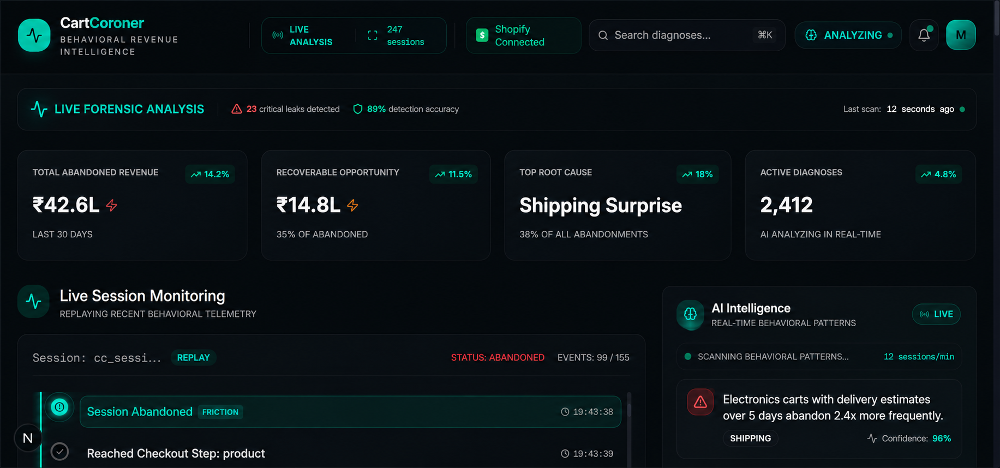

  <h1>CartCoroner AI</h1>
  <p><strong>Behavioral Forensic Intelligence for Shopify.</strong></p>

  <p>
    <em>Most analytics tools explain WHAT happened.<br>
    CartCoroner explains WHY it happened.</em>
  </p>

  <p>
    <a href="https://cartcoroner-ai.vercel.app/"></a>
    &nbsp;
    <a href="https://samd444-cartcoroner-backend.hf.space/docs"></a>
    &nbsp;
    <a href="https://samd444-cartcoroner-backend.hf.space/health"></a>
    &nbsp;
    
  </p>
</div>

---

## 🌐 Live Deployment

| Service | URL |
|---------|-----|
| 🖥️ **Live Dashboard** | [cartcoroner-ai.vercel.app](https://cartcoroner-ai.vercel.app/) |
| 🔀 **Preview Branch** | [cartcoroner-ai-git-main-sambhav-das-projects.vercel.app](https://cartcoroner-ai-git-main-sambhav-das-projects.vercel.app/) |
| ⚙️ **Backend API** | [samd444-cartcoroner-backend.hf.space](https://samd444-cartcoroner-backend.hf.space) |
| 📖 **Swagger / API Docs** | [samd444-cartcoroner-backend.hf.space/docs](https://samd444-cartcoroner-backend.hf.space/docs) |
| ❤️ **Health Check** | [samd444-cartcoroner-backend.hf.space/health](https://samd444-cartcoroner-backend.hf.space/health) |

> Cloud deployment includes uptime monitoring to maintain stable public accessibility during demonstrations and evaluations.

### 🎥 Demo Video: [CartCoroner AI Walkthrough](https://drive.google.com/file/d/1hEm1d0tIuzlF0udNsWPKFN8mEW4PUc0b/view?usp=drive_link)

**CartCoroner analyzes REAL Shopify storefront behavioral telemetry to detect why users abandon carts — then diagnoses the exact friction type causing abandonment using Groq AI reasoning.**

---

## 🛑 The Problem: Traditional Analytics Are Blind

Most cart recovery tools treat abandonment as the problem. **CartCoroner treats abandonment as the symptom.**

Traditional analytics tell you that a user dropped off at the checkout step. They don't tell you if the user hesitated on shipping costs, got paralyzed by variant choices, or lost trust at the payment gateway. Sending a generic 10% discount to all abandoned carts is guessing, not intelligence.

## 🧬 Our Innovation: Behavioral Forensic Intelligence

*Most AI shopping tools are reactive. CartCoroner is behavioral forensic intelligence.*

**This system captures REAL behavioral telemetry from Shopify storefront sessions.** By injecting a lightweight tracking layer into your Shopify storefront, we monitor micro-interactions (hesitation, variant toggling, cart adjustments) in real-time. When a session is abandoned, our AI reasoning engine performs an "autopsy" on the session telemetry to diagnose the exact root cause of friction.

---

## ☁️ Deployment Architecture

CartCoroner is a fully cloud-deployed platform with no local dependencies required to experience the live system.

```
Shopify Storefront  (theme.liquid tracker)
        ↓
  Behavioral Telemetry JS  (variant, shipping, revisit, abandon events)
        ↓
  FastAPI Backend  ── Hugging Face Spaces (Docker, Python 3.11)
        ↓
  Supabase PostgreSQL  ── Cloud database (session_events + diagnoses tables)
        ↓
  Groq AI Engine  ── LLaMA 3.3 70B (behavioral root cause reasoning)
        ↓
  Next.js Dashboard  ── Vercel (real-time forensic intelligence UI)
```

### Why this architecture?

| Decision | Rationale |
|----------|-----------|
| **Vercel** for frontend | Zero-config deployment, edge CDN, instant previews per branch |
| **Hugging Face Spaces** for backend | Free Docker hosting with GPU-adjacent infra, no cold-start penalty |
| **Supabase** for database | Managed PostgreSQL with real-time capabilities and REST API |
| **Groq** for AI inference | Fastest LLM inference available — LLaMA 3.3 70B at production latency |
| **Shopify Liquid** for tracking | Native storefront integration, no third-party permissions needed |

---

## 📸 Platform Gallery

### 1. CartCoroner Live Forensic Dashboard
*(Main AI behavioral intelligence dashboard with live session monitoring)*
<div align="center">
  
</div>

### 2. Supabase Telemetry Event Pipeline
*(Real-time session events stored from Shopify storefront tracking)*
<div align="center">
  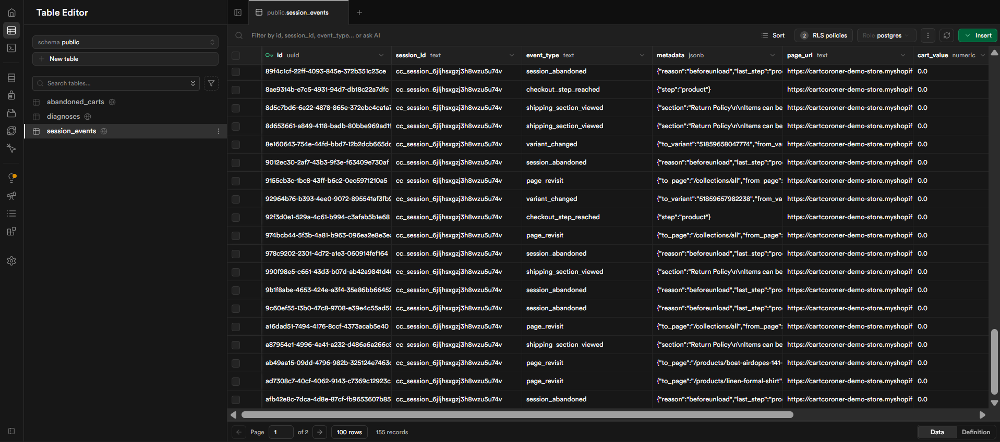
</div>

### 3. Shopify Storefront Product Interaction Tracking
*(Variant selection and product behavior capture system)*
<div align="center">
  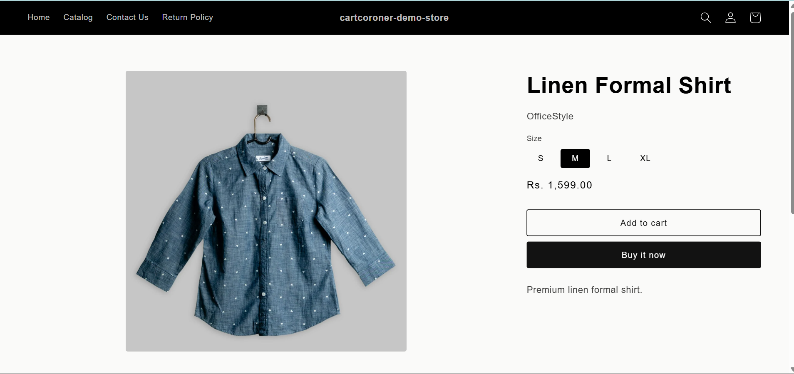
</div>

### 4. Cart Drawer & Checkout Intent Monitoring
*(Cart activity and checkout progression tracking)*
<div align="center">
  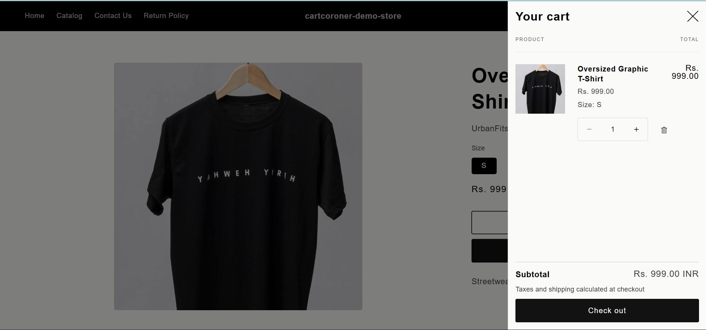
</div>

### 5. Checkout Shipping Friction Detection
*(Shipping-stage behavioral analytics and abandonment triggers)*
<div align="center">
  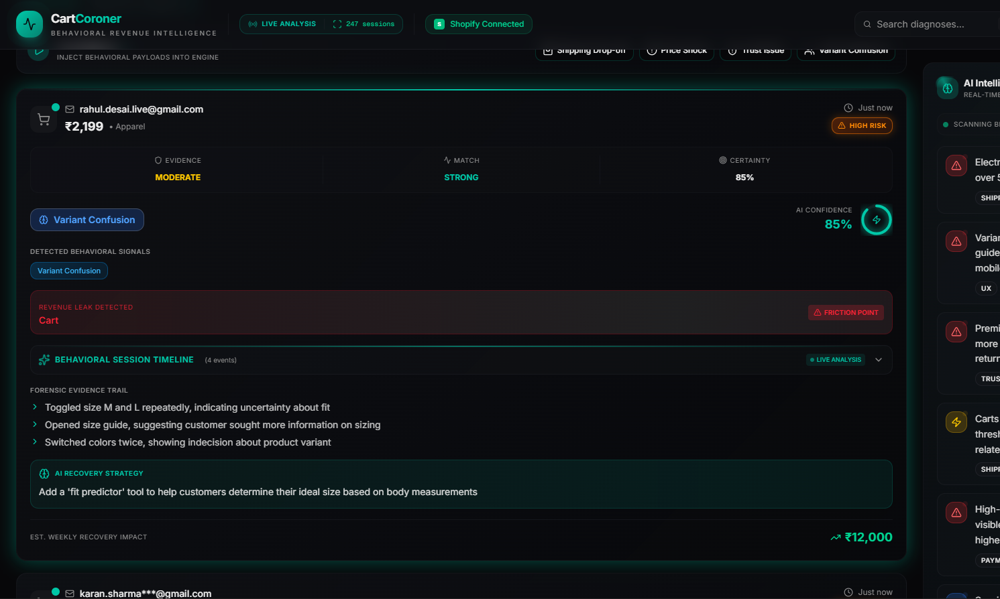
</div>

### 6. AI Diagnosis — Price Shock Detection
*(Behavioral analysis for high-value cart hesitation)*
<div align="center">
  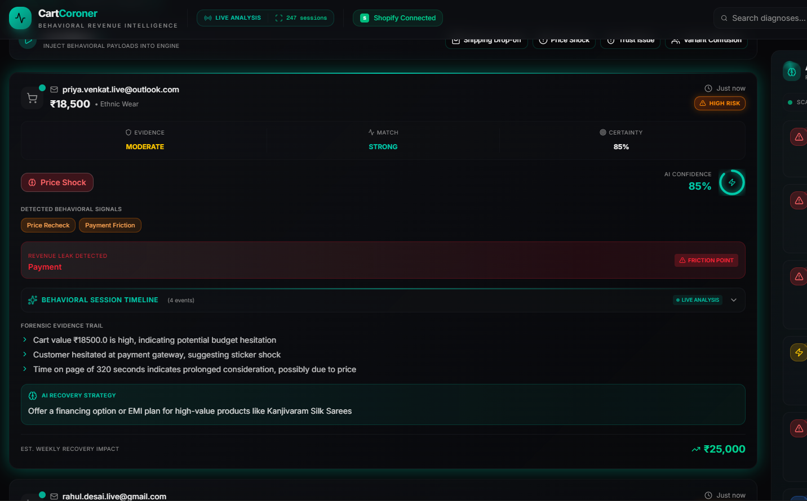
</div>

### 7. AI Diagnosis — Shipping Surprise Detection
*(AI-generated forensic diagnosis for shipping-related abandonment)*
<div align="center">
  
</div>

### 8. AI Diagnosis — Variant Confusion Detection
*(Session replay showing repeated variant switching behavior)*
<div align="center">
  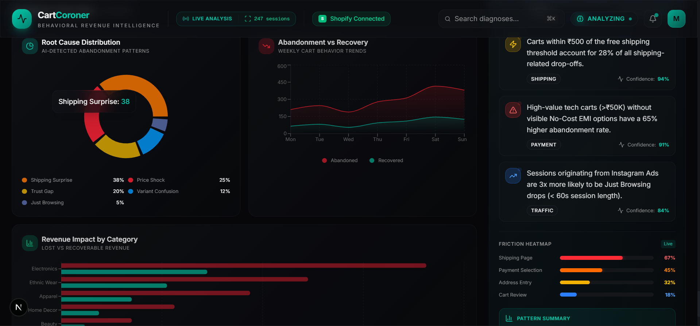
</div>

### 9. Behavioral Revenue Analytics & Root Cause Distribution
*(Revenue leak analysis, abandonment trends, and category impact visualization)*
<div align="center">
  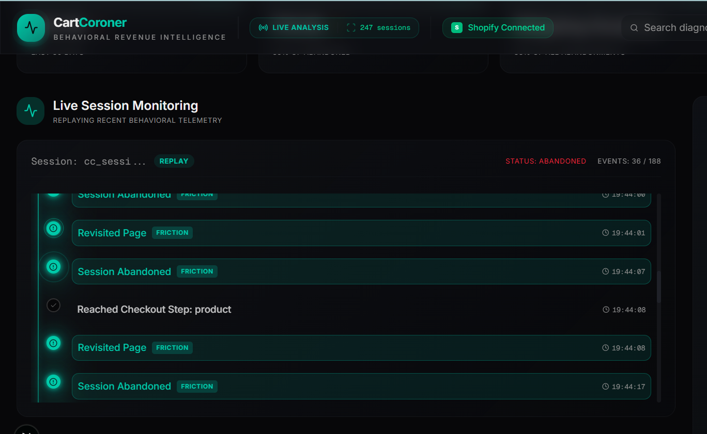
</div>

### 10. Live Session Replay Timeline
*(Chronological replay of real storefront behavioral telemetry)*
<div align="center">
  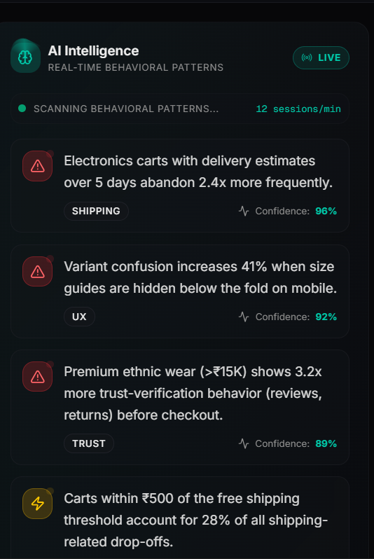
</div>

### 11. AI Intelligence Feed & Friction Heatmap
*(Real-time AI insights, abandonment signals, and friction concentration analysis)*
<div align="center">
  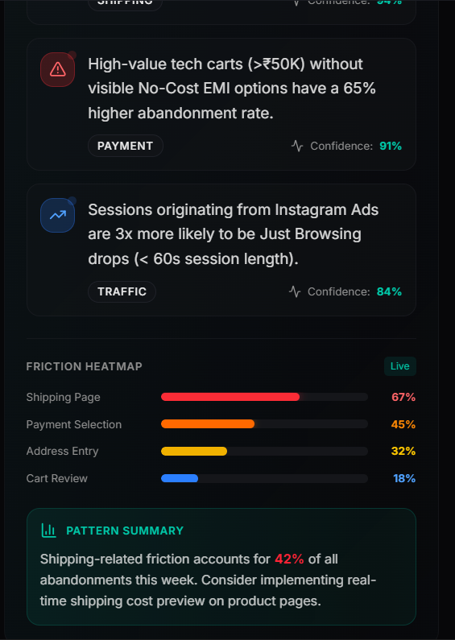
</div>

### 12. CartCoroner System Architecture & Real-Time Behavioral Intelligence Pipeline
*(End-to-end architecture: Shopify telemetry capture → FastAPI → Supabase → Groq → Dashboard)*
<div align="center">
  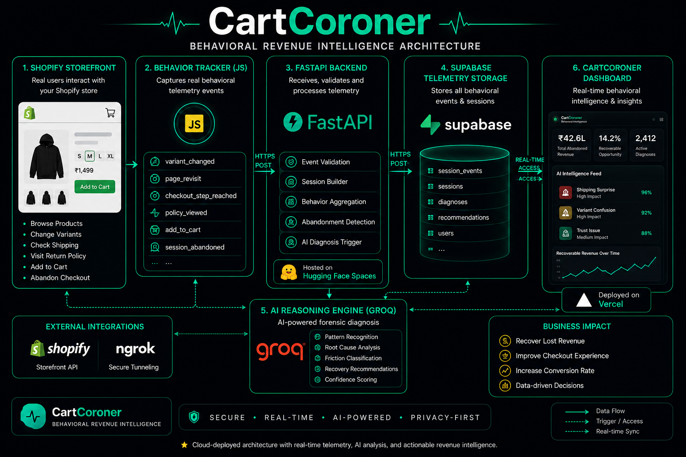
</div>

---

## 📡 Live Telemetry Pipeline

CartCoroner doesn't simulate. It captures real behavioral telemetry from Shopify sessions:

| Event | What It Captures |
|-------|-----------------|
| `variant_changed` | Decision paralysis — size and color switching behavior |
| `checkout_step_reached` | Exact funnel breakpoint identification |
| `shipping_section_viewed` | Delivery cost friction detection |
| `page_revisit` | Comparison shopping and hesitation signals |
| `session_abandoned` | The exact moment and context of failure |

Each event is transmitted asynchronously to the FastAPI backend, persisted in Supabase, and made immediately available for AI diagnosis.

---

## 🔌 API Reference

Full interactive documentation available at **[samd444-cartcoroner-backend.hf.space/docs](https://samd444-cartcoroner-backend.hf.space/docs)** — auto-generated by FastAPI's OpenAPI engine.

| Method | Endpoint | Description |
|--------|----------|-------------|
| `GET` | `/health` | Service health + connection status |
| `POST` | `/diagnose` | Submit cart payload for AI root cause diagnosis |
| `POST` | `/recovery` | Generate personalized cart recovery message |
| `GET` | `/diagnoses` | Retrieve latest 50 AI diagnoses |
| `GET` | `/patterns` | Aggregate behavioral pattern analytics |
| `POST` | `/webhook/shopify` | Receive Shopify abandonment webhooks |
| `POST` | `/session/event` | Ingest real-time storefront telemetry event |
| `GET` | `/session/latest` | Get most recent active session ID |
| `GET` | `/session/{id}/events` | Full event timeline for a session |
| `POST` | `/session/{id}/diagnose` | AI diagnosis from real session telemetry |

### Root Cause Categories

| Code | Merchant Label | Trigger Pattern |
|------|---------------|-----------------|
| `PRICE_SHOCK` | Budget Resistance | High cart value, payment-step drop-off |
| `SHIPPING_SURPRISE` | Delivery Friction | Unexpected costs at shipping stage |
| `TRUST_GAP` | Confidence Breakdown | Review/return-policy interactions before exit |
| `VARIANT_CONFUSION` | Decision Paralysis | Repeated size/variant toggling |
| `JUST_BROWSING` | Low Purchase Intent | Short session, low cart value |

---

## ✨ Feature Highlights

- **Real-Time Behavioral Telemetry** — Captures true user intent through storefront micro-interactions
- **AI-Powered Forensic Diagnosis** — Groq LLaMA 3.3 70B analyzes session behavioral patterns
- **Root-Cause Classification** — Five evidence-based abandonment categories with confidence scoring
- **Targeted Recovery Strategies** — Specific, actionable merchant recommendations per diagnosis
- **Live Session Replay** — Chronological timeline of every storefront interaction
- **Behavioral Revenue Analytics** — Weekly recovery opportunity quantified in INR

---

## 🚀 How Judges Can Test CartCoroner

### Option A — Live Cloud Demo (No Setup Required)

1. **Open Dashboard** → [cartcoroner-ai.vercel.app](https://cartcoroner-ai.vercel.app/)
2. **Observe Live Monitor** — The session monitor initializes and replays the latest behavioral session from Supabase
3. **Trigger AI Demo** — Click any scenario button (Shipping Drop-off, Price Shock, Trust Issue, Variant Confusion) in the Behavioral Intelligence Feed
4. **Watch AI Reasoning** — The Groq engine diagnoses the behavioral payload and returns a forensic report with evidence, root cause, and recovery recommendation
5. **Check API** → [samd444-cartcoroner-backend.hf.space/docs](https://samd444-cartcoroner-backend.hf.space/docs)

### Option B — Real Storefront Telemetry Flow

1. Navigate to the Shopify demo storefront as a real customer
2. Interact with products — toggle variants, reach checkout, revisit pages
3. Close the tab to trigger `session_abandoned`
4. Open the CartCoroner dashboard — your session appears live in the monitor
5. Trigger AI Diagnosis — watch the behavioral autopsy run on your real session

---

## 🛠️ Local Development Setup

### Prerequisites
- Node.js 18+ and npm
- Python 3.11+
- Supabase account + Groq API key

### Backend (FastAPI)

```bash
cd backend
python -m venv .venv
.venv\Scripts\activate        # Windows
# source .venv/bin/activate   # macOS/Linux
pip install -r requirements.txt
cp .env.example .env          # Fill in GROQ_API_KEY, SUPABASE_URL, SUPABASE_KEY
uvicorn main:app --reload --port 7860
# API available at http://localhost:7860
# Swagger docs at http://localhost:7860/docs
```

### Frontend (Next.js)

```bash
cd frontend
npm install
npm run dev
# Dashboard at http://localhost:3000
```

### Shopify Telemetry (Local Testing with ngrok)

```bash
# Expose local backend to Shopify's HTTPS requirement
ngrok http 7860
# Copy the ngrok HTTPS URL
# Update tracker script endpoint in Shopify theme.liquid
```

### Environment Variables

```env
# backend/.env
GROQ_API_KEY=your_groq_api_key
SUPABASE_URL=https://your-project.supabase.co
SUPABASE_KEY=your_supabase_anon_or_publishable_key
SHOPIFY_WEBHOOK_SECRET=your_webhook_secret
```

---

## 💻 Tech Stack

| Layer | Technology |
|-------|-----------|
| **AI Reasoning** | Groq API — LLaMA 3.3 70B Versatile |
| **Frontend** | Next.js 16, Tailwind CSS v4, Recharts, Lucide Icons |
| **Backend** | FastAPI, Python 3.11, Uvicorn |
| **Database** | Supabase (PostgreSQL) |
| **Storefront Tracking** | Vanilla JavaScript (Shopify theme.liquid) |
| **Frontend Hosting** | Vercel (Edge CDN) |
| **Backend Hosting** | Hugging Face Spaces (Docker) |

---

## 🗺️ Future Roadmap

- **Predictive Abandonment Scoring** — Intervene *before* the customer leaves
- **Automated A/B Testing** — Dynamically test AI-generated recovery copy against live traffic
- **Heatmap Integration** — Overlay spatial interaction data onto session timelines
- **ESP Integrations** — Direct hooks into Klaviyo and Mailchimp for autonomous recovery deployment
- **Multi-store Analytics** — Aggregate behavioral patterns across Shopify merchant portfolios

---

## 👥 Team

Built for the **Kasparro Agentic Commerce Hackathon 2026**.

**Contribution Note:** This is a solo submission. All frontend, backend, telemetry tracking, and AI integration was developed entirely by a single developer within the hackathon timeframe.

## 📄 License

MIT License. See `LICENSE` for details.

## ✉️ Contact

For hackathon judging and inquiries, reach out through GitHub Issues or the provided hackathon submission channels.
