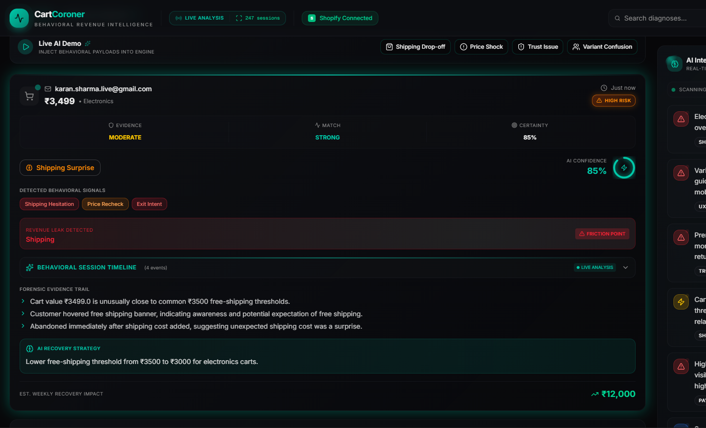

<div align="center">
  

  <h1>CartCoroner AI</h1>
  <p><strong>Behavioral Forensic Intelligence for Shopify.</strong></p>

  <p>
    <em>Most analytics tools explain WHAT happened.<br>
    CartCoroner explains WHY it happened.</em>
  </p>
</div>

---

## 🛑 The Problem: Traditional Analytics Are Blind

Most cart recovery tools treat abandonment as the problem. **CartCoroner treats abandonment as the symptom.** 

Traditional analytics tell you that a user dropped off at the checkout step. They don't tell you if the user hesitated on shipping costs, got paralyzed by variant choices, or lost trust at the payment gateway. Sending a generic 10% discount to all abandoned carts is guessing, not intelligence.

## 🧬 Our Innovation: Behavioral Forensic Intelligence

*Most AI shopping tools are reactive. CartCoroner is behavioral forensic intelligence.*

**This system captures REAL behavioral telemetry from Shopify storefront sessions.** By injecting a lightweight tracking layer into your Shopify storefront, we monitor micro-interactions (hesitation, variant toggling, cart adjustments) in real-time. When a session is abandoned, our AI reasoning engine performs an "autopsy" on the session telemetry to diagnose the exact root cause of friction.

## 📡 Live Telemetry Explanation

CartCoroner doesn't guess. We track exact session events in real-time:
- `variant_changed`: Tracking decision paralysis and product exploration.
- `checkout_step_reached`: Understanding exactly where the funnel breaks.
- `page_revisit`: Identifying comparison shopping or confusion.
- `session_abandoned`: The exact moment of failure.

[Read the full Telemetry Explanation here](telemetry_explanation.md)

---

## 📸 Platform Overview

### 1. CartCoroner Live Forensic Dashboard
*(Main AI behavioral intelligence dashboard with live session monitoring)*
<div align="center">
  
</div>

### 2. Supabase Telemetry Event Pipeline
*(Real-time session events stored from Shopify storefront tracking)*
<div align="center">
  
</div>

### 3. Shopify Storefront Product Interaction Tracking
*(Variant selection and product behavior capture system)*
<div align="center">
  
</div>

### 4. Cart Drawer & Checkout Intent Monitoring
*(Cart activity and checkout progression tracking)*
<div align="center">
  
</div>

### 5. Checkout Shipping Friction Detection
*(Shipping-stage behavioral analytics and abandonment triggers)*
<div align="center">
  
</div>

### 6. AI Diagnosis — Shipping Surprise Detection
*(AI-generated forensic diagnosis for shipping-related abandonment)*
<div align="center">
  
</div>

### 7. AI Diagnosis — Price Shock Detection
*(Behavioral analysis for high-value cart hesitation)*
<div align="center">
  
</div>

### 8. AI Diagnosis — Variant Confusion Detection
*(Session replay showing repeated variant switching behavior)*
<div align="center">
  
</div>

### 9. Behavioral Revenue Analytics & Root Cause Distribution
*(Revenue leak analysis, abandonment trends, and category impact visualization)*
<div align="center">
  
</div>

### 10. Live Session Replay Timeline
*(Chronological replay of real storefront behavioral telemetry)*
<div align="center">
  
</div>

### 11. AI Intelligence Feed & Friction Heatmap
*(Real-time AI insights, abandonment signals, and friction concentration analysis)*
<div align="center">
  
</div>

### 12. CartCoroner System Architecture & Real-Time Behavioral Intelligence Pipeline
*(End-to-end architecture showing Shopify telemetry capture, FastAPI processing, Supabase storage, Groq-powered AI diagnosis, and forensic dashboard visualization)*
<div align="center">
  
</div>

---

## 🏗️ System Architecture

Our architecture bridges real-time storefront telemetry with forensic AI reasoning:

**Shopify Storefront** (Liquid/JS)
↓ *Behavior Tracker JS captures live events*
**FastAPI Backend** (Python)
↓ *Ingests and normalizes event streams*
**Supabase Telemetry Storage** (PostgreSQL)
↓ *Persists session timelines*
**Groq AI Reasoning Engine** (Llama 3)
↓ *Diagnoses root causes and generates recovery strategies*
**Behavioral Intelligence Dashboard** (Next.js)

## ✨ Feature Highlights

- **Real-Time Behavioral Telemetry**: Captures true user intent through storefront interactions.
- **AI-Powered Forensic Diagnosis**: Groq-powered reasoning engine analyzes sessions to find friction.
- **Root-Cause Intelligence**: Classifies abandonment into actionable categories (e.g., Price Shock, Trust Gap, Shipping Surprise).
- **Targeted Recovery Strategies**: Generates highly specific, customized recovery recommendations based on exact behavior.
- **Premium Live Session Dashboard**: Dark futuristic interface for real-time behavioral monitoring.

## 🚀 How Judges Can Test CartCoroner

Follow these steps to experience the complete forensic intelligence flow:

1. **Open Storefront**: Navigate to the provided Shopify demo storefront as a real customer.
2. **Browse Products**: Interact naturally with the products.
3. **Trigger Behavioral Actions**: Toggle multiple variants rapidly, reach checkout, and revisit product pages.
4. **Observe Telemetry Capture**: Close the tab to trigger a `session_abandoned` event. You can observe the raw telemetry data hitting our Supabase instance.
5. **Open Dashboard**: Navigate to the CartCoroner Live Dashboard link.
6. **Run Diagnosis**: Select your abandoned session from the Live Monitor and trigger the AI Diagnosis.
7. **Observe AI Reasoning**: Watch as the AI breaks down your exact behavior and outputs a behavioral root cause (e.g., *Decision Paralysis*) alongside a tailored recovery strategy.

[See full Demo Script here](demo_script.md)

## 💻 Tech Stack

- **AI Reasoning**: Groq API (Llama 3 70B)
- **Frontend Dashboard**: Next.js 14, Tailwind CSS, Lucide Icons
- **Backend Service**: FastAPI (Python)
- **Database**: Supabase (PostgreSQL)
- **Storefront Tracking**: Vanilla JavaScript (Shopify theme.liquid)

## 🛠️ Setup Instructions

### 1. Supabase Setup
- Create a Supabase project.
- Execute the SQL schema (found in `backend/sql/schema.sql` if applicable) to create the `session_events` table.

### 2. Backend (FastAPI)
```bash
cd backend
python -m venv .venv
source .venv/bin/activate  # On Windows: .venv\Scripts\activate
pip install -r requirements.txt
cp .env.example .env # Configure Supabase and Groq keys
uvicorn main:app --reload
```

### 3. Frontend (Next.js)
```bash
cd frontend
npm install
npm run dev
```

### 4. Shopify Storefront Tracking
- Copy the tracking script (e.g., from `scripts/cartcoroner-tracker.liquid`) and place it before the `</body>` tag in your Shopify `theme.liquid`.
- Ensure the tracker points to your running FastAPI backend URL.

## 🗺️ Future Roadmap

- **Predictive Abandonment Scoring**: Intervene *before* the customer leaves.
- **Automated A/B Testing**: Dynamically test AI-generated recovery copy against live traffic.
- **Heatmap Integration**: Overlay spatial interaction data onto session timelines.
- **ESP Integrations**: Direct hooks into Klaviyo and Mailchimp for autonomous recovery deployment.

## 👥 Team

Built for the **Kasparro Agentic Commerce Hackathon 2026**.

## 📄 License

MIT License. See `LICENSE` for more details.

## ✉️ Contact

For hackathon judging and inquiries, please reach out to the project maintainers through GitHub Issues or the provided hackathon submission channels.
